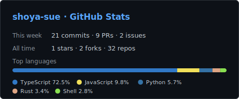

# SHO　·　shoya-sue

### AI Agent × Web3 Payments Developer

自律エージェントとオンチェーン決済インフラをつくっています &nbsp;·&nbsp; Japan 🇯🇵

---

## 🚀 Now

- **[x402Explorer](https://github.com/shoya-sue/x402Explorer)** — AIエージェント決済時代のインフラインデックスを構築中
- AI Agent と Solana を軸に、自動化・可視化ツールを継続的に開発しています

## ⭐ Featured Projects

<!-- 手動キュレーション領域。テーマ性・新しさで厳選（public リポジトリのみ） -->

| Project | What it does | Tech |
| :--- | :--- | :--- |
| **[x402Explorer](https://github.com/shoya-sue/x402Explorer)** | x402 エコシステムの成長を可視化する、AIエージェント決済時代のインフラインデックス | `TypeScript` |
| **[solana-weekly-report](https://github.com/shoya-sue/solana-weekly-report)** | Solana のトランザクション履歴を週次レポートに自動整形 | `JavaScript` |
| **[VibeCordingJsons](https://github.com/shoya-sue/VibeCordingJsons)** | Claude Code のベストプラクティス設定をまとめたテンプレート集 | `Shell` |
| **[SimpleVault](https://github.com/shoya-sue/SimpleVault)** | Solana の Token Vault スマートコントラクト | `TypeScript` |
| **[DisasterMesh](https://github.com/shoya-sue/DisasterMesh)** | Cypherpunk Hackathon 出展の分散メッシュ通信デモ | `TypeScript` |

## 🧰 Tech Stack

<!-- TECH_ARSENAL_START -->

<!-- TECH_ARSENAL_END -->

## 📊 Stats

<!-- 自前ホストSVG（assets/）。GitHub Actions が週次で再生成します。外部API依存ゼロ -->
<!-- WEEKLY_ACTIVITY_START -->

  <picture>
    <source media="(prefers-color-scheme: dark)" srcset="./assets/github-stats-dark.svg">
    <source media="(prefers-color-scheme: light)" srcset="./assets/github-stats-light.svg">
    
  </picture>
   
  🤖 <em>Last updated: 2026年6月30日 11:08</em>

<!-- WEEKLY_ACTIVITY_END -->
